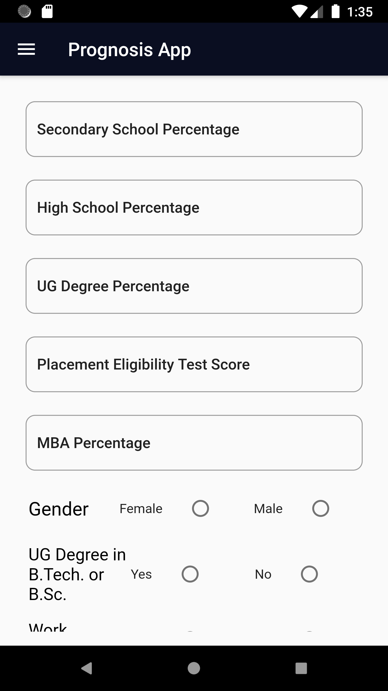
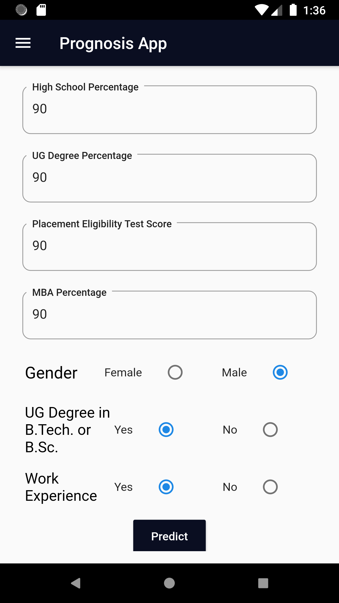
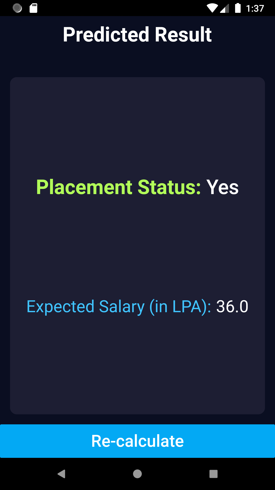
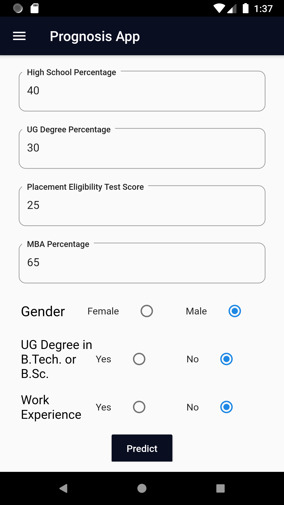
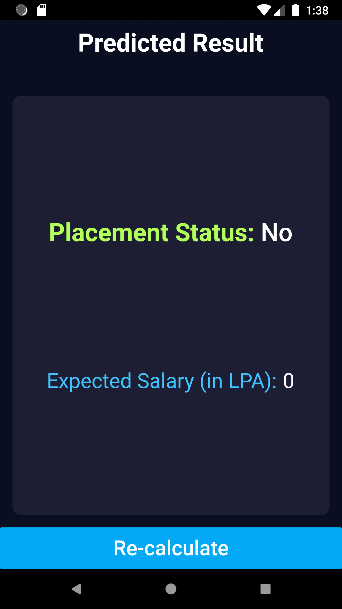
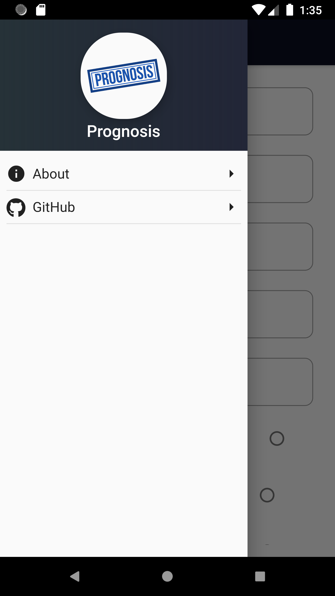
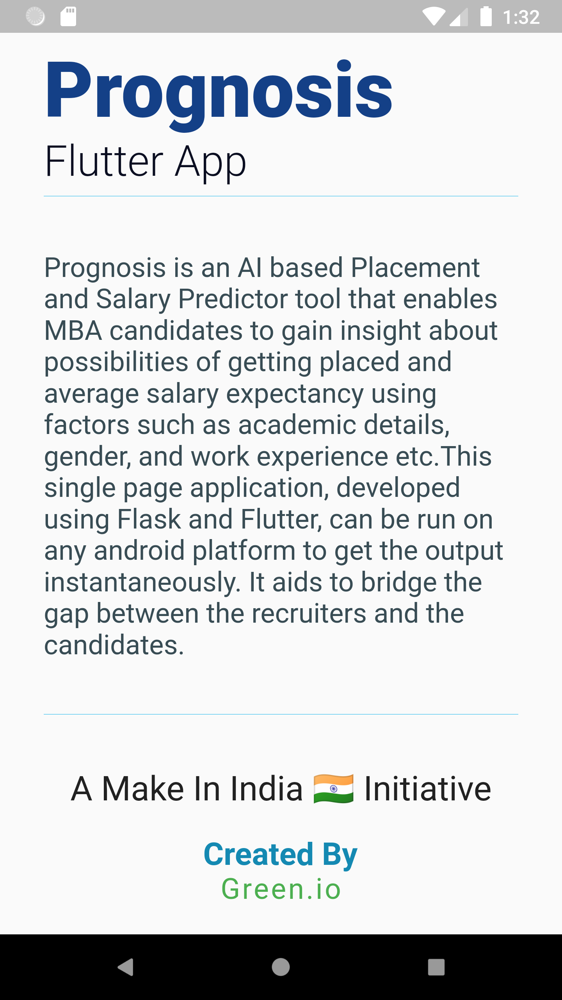

# Prognosis Android Application

## About the Application:
Prognosis is an **AI based Placement and Salary Predictor** tool that enables MBA recruits and candidates to gain insight about possibilities of getting placed and average salary expectancy using factors such as academic details, percentages, and work experience etc.
This is an android application, developed using Flutter and Flask, can be run on any android mobile phone to get the output instantaneously. It aids to bridge the gap between the recruiters and the candidates.

## View Demo:
https://youtu.be/dcKjbdTzogQ

## Screenshots:
</a>
</a>
</a>
</a>
</a>
</a>
</a>

